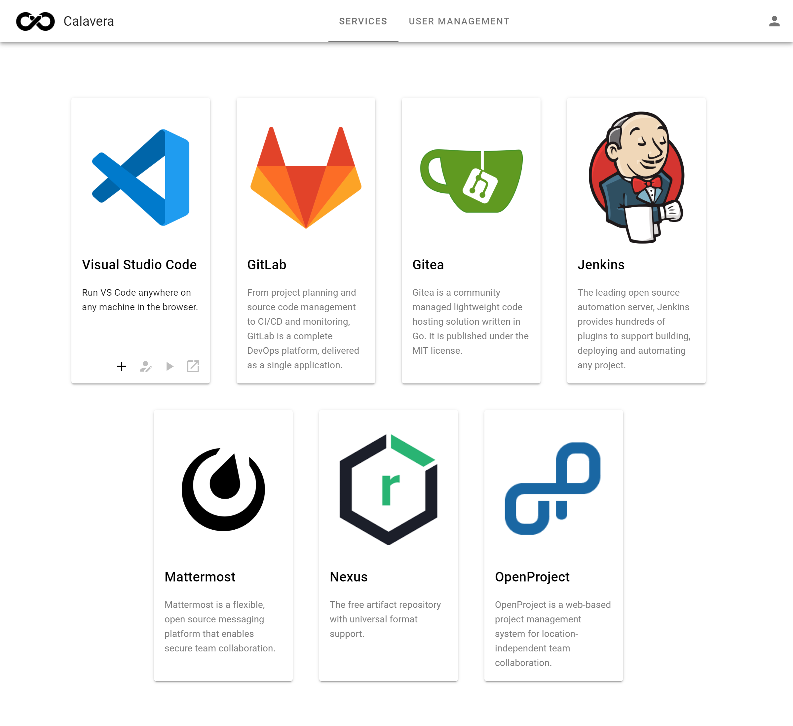

# Calavera: A fully featured web-based development environment
Calavera is fully featured web-based development environment deloyed on **Kubernetes** with serveral available services! It has everything a team needs to develop applications. From a project management tool like **OpenProject** to the web-hosted editor **Visual Studio Code** is everything needed included. Even deploying applications in the Kubernetes Cluster is possible with a user namespace which is available without further configuration or authorization in the editor to access.

**Included services:**
- OpenLDAP
- Keycloak
- Gitea
- GitLab
- Jenkins
- Nexus OSS
- Mattermost
- OpenProject
- Visual Studio Code

Related repositories:
- [Calavera Helm Chart](https://github.com/simwak/charts/tree/main/charts/calavera)
- [Calavera Dashboard](https://github.com/simwak/calavera-dashboard)
- [Calavera API](https://github.com/simwak/calavera-api)
- [VS Code Server on Kubernetes](https://github.com/simwak/k8s-code-server)

## Prerequisites
- Kubernetes 1.15+
- Helm 3
- [Traefik 2](https://docs.traefik.io/) as IngressController
- Persistent Storage (default StorageClass)
- DNS entry for `*.yourdomain.com` to your Traefik Ingress
- DNS entry for `*.editor.yourdomain.com` or `*.*.yourdomain.com` to your Traefik Ingress

Tested on **AWS EKS** and **k3s**.

## Install
``` bash
terraform init
terraform apply -var-file=values.tfvars
```

Create a `values.tfvars` or use one from the `examples/` directory and adjust it to your environment.

## Known Issues
- GitLab Runner Chart: X509: certificate signed by unknown authority  
  **Description**: The current runner chart (0.20.1) is unable to set a custom CA correctly. [Issue 81](https://gitlab.com/gitlab-org/charts/gitlab-runner/-/issues/81)  
  **Workaround**: Manually setting the env variable `CI_SERVER_TLS_CA_FILE` to the path of a full-chain certifcate. Execute `kubectl edit deployment {{ release_name }}-gitlab-gitlab-runner` (Replace `{{ release_name }}` with the actual value) and add the variable `CI_SERVER_TLS_CA_FILE`. 
  ``` yaml
  env:
  - name: CI_SERVER_TLS_CA_FILE
    value: /home/gitlab-runner/.gitlab-runner/certs/lets_encrypt_staging_root.pem
  ```
- GitLab: SSH will not work  
  **Description**: Becouse SSH is not routeable with Traefik like HTTPS it cannot be used. It also cannot be disable automatically trough the chart settings.  
  **Workaround**: Login as a GitLab Administrator and disable SSH under Admin Area → System Settings → Enabled Git access protocols → Only HTTP(S)  
- GitLab: Disable self.registration  
  **Description**: Registration should be disabled for GitLab as only LDAP is used. This is to prevent security incidents like [this](https://www.teiss.co.uk/daimler-ag-mercedes-source-code-leak/). The chart does not support this option currently. [Issue 2837](https://gitlab.com/gitlab-org/omnibus-gitlab/-/issues/2837)  
  **Workaround**: Login as a GitLab Administrator and disable self registration in the Admin Area.
- Gitea Login only works with UID or OAuth  
  **Description**: You cannot use your E-Mail address right now for the gitea login  
  **Workaround**: Use your UID or OAuth

## FAQ
### With which credentials can I log in?
Always use your E-Mail address. The uid/username also works in a few services.

### How long does it take until all services are ready?
Most of the services are ready in about 3-4 minutes. OpenProject needs about 7-8 minutes becouse of the complex configuration method with a sidecar. It restarts once after it has been configured.

### How can I login as a GitLab administrator/root user?
Synchronization of LDAP groups/roles are not available in GitLab CE, therefore it is not possible to grant the default LDAP administrator GitLab administrator rights. To login as a administrator use the user `root` with the password from `kubectl get secret {{ release_name }}-gitlab-gitlab-initial-root-password --template={{.data.password}} | base64 -d` (Replace `{{ release_name }}` with the actual value). You can login without SSO at `https://{{ domains.gitlab }}/users/sign_in?auto_sign_in=false` (Replace `{{ release_name }}` with the actual value). You also grant the administrator rights to your user now in Admin Area → Users → Your user → Edit.


## Maintainer
This project was developed as a part of a bachelor thesis at the Hochschule für Telekommunikation in Leipzig (HfTL).

Maintainer and creator is:  
Simon Wakenhut (<simon@simonwakenhut.me>)